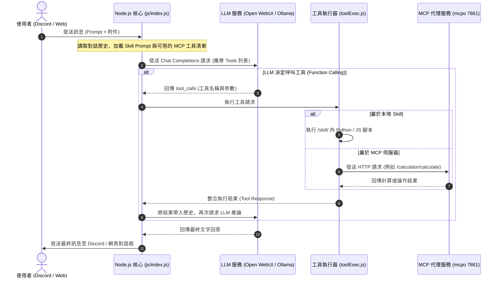

# Nexus AI Assistant

**Nexus AI Assistant** 是一個整合了大型語言模型（LLM）與 Discord 平台的 AI 助手專案。它採用了**混合工具執行架構**，同時支援 **Model Context Protocol (MCP)** 伺服器與 **Skill** (自訂技能) 作為 LLM 的工具調用機制，並透過 OpenAPI Proxy 將這些工具轉換為標準的 OpenAI 格式，使任何支援 OpenAPI 的 LLM 服務（如 Open WebUI）與 Discord Bot 都能夠存取並呼叫這些工具。

本專案的核心價值在於提供一個可擴展、模組化的架構，讓使用者可以透過 Discord 或 Web 介面與 LLM 互動，並賦予 LLM 執行網路搜尋、檔案操作、多媒體處理、以及物聯網（IoT）設備控制等能力。

---

## 核心功能 (Key Features)

*   **多端互動介面**：
    *   **Discord Bot**：提供直覺的自然語言聊天與 slash 指令（如 `/chat`、`/llm`、`/memory`），支援文字、語音與附件。
    *   **Web Management UI**：提供單頁面應用 (SPA) 網頁，用於即時監控系統狀態、發送遠端系統指令、管理日誌以及與 LLM 對話。
*   **強大的附件處理**：
    *   支援解析 `.txt`, `.json`, `.md`, `.pdf` 等多種文字格式檔案。
    *   支援 `.jpg`, `.png` 圖片分析（需搭配支援 Vision 的模型）。
*   **混合工具執行 (Hybrid Tool Execution)**：
    *   **MCP 工具呼叫**：整合多個本地與遠端 MCP 伺服器（包含計算器、多媒體 FFmpeg 轉碼、檔案系統操作、網路搜尋與時間查詢等）。
    *   **Skill 系統**：動態執行腳本或基於自訂 Prompt 範本的推論邏輯，支援多階段推論與熱重載。
*   **即時可觀測性**：
    *   Web UI 介面可顯示 CPU、記憶體與流量等硬體資源即時狀態。
    *   採用 Winston & Winston Daily Rotate File 進行日誌分類（分為 error、info、success），確保系統運作的可追溯性。
*   **IoT 物聯網整合**：
    *   支援透過 MQTT 協議與物聯網設備通訊（例如智慧小車的即時監控、軌跡與狀態日誌）。
    *   當 IoT 設備狀態異常時，會透過 Discord 警報頻道自動發送通知提醒。

---

## 資料夾結構 (Project Structure)

本專案採用 Python 與 Node.js 雙語言混合架構，整體目錄樹狀結構如下：

```text
JupyterProject/                         # 專案根目錄
├── .idea/                              # PyCharm 專案配置與環境設定
├── .ruff_cache/                        # Python 代碼格式化工具 Ruff 的快取
├── .venv/                              # Python 虛擬環境目錄
├── data/                               # 核心數據存放目錄
│   └── API.txt                         # 存放外部服務 API Key 與端點資訊
├── js/                                 # Node.js 核心組件 (Discord Bot & Web Backend)
│   ├── cmd/                            # Discord 機器人與系統指令處理模組
│   │   ├── chat/                       # 聊天指令的核心子邏輯
│   │   │   ├── format.js               # 處理 LLM 輸出與 Discord 消息格式轉換
│   │   │   ├── history.js              # 對話歷史的讀取、寫入與長度控制
│   │   │   ├── mcpo.js                 # 與 MCP 伺服器通訊的底層封裝
│   │   │   ├── skill.js                # 自訂技能 (Skill) 的加載與執行器
│   │   │   ├── toolExec.js             # Function Calling 工具執行調度器
│   │   │   └── tools.js                # 靜態工具定義與參數校驗
│   │   ├── backup/                     # 舊版或開發中指令備份
│   │   ├── chat.js                     # /chat 核心指令 (整合文字、語音與附件)
│   │   ├── help.js                     # /help 指令 (動態生成功能清單)
│   │   ├── llm.js                      # /llm 指令 (即時切換模型或調整溫控)
│   │   ├── memory.js                   # /memory 指令 (導出或清除對話記憶)
│   │   ├── newchat.js                  # /newchat 指令 (強制開啟全新對話)
│   │   └── redocmd.js                  # 系統熱重載與指令註冊更新
│   ├── data/                           # 系統運行時所需的靜態配置與動態數據
│   │   ├── car/                        # IoT 小車相關數據
│   │   │   ├── car_log.json            # 小車運行軌跡與日誌
│   │   │   └── car_status.json         # 小車當前狀態
│   │   ├── history/                    # 頻道對話歷史存檔 (.json)
│   │   ├── config.json                 # JS 組件的內部通用設定 (含 IP 與 API Key)
│   │   ├── discorddata.json            # Discord Bot 密鑰與頻道 ID 配置
│   │   ├── llmprompt.json              # 預設的 System Role 與 Prompt 模板
│   │   ├── llmserver.json              # LLM 遠端 API 端點與連線設定
│   │   ├── llmtool.json                # 註冊給 LLM 的工具描述清單
│   │   ├── root.json                   # 管理員名稱與 bcrypt 加密密碼
│   │   ├── tools_config.json           # 工具執行的白名單與權限設定
│   │   └── user.json                   # 系統註冊用戶資訊與統計
│   ├── getdata/                        # 外部資源獲取與權限校驗模組
│   │   ├── crypto.js                   # 加密與解密工具 (AES)
│   │   ├── discord_Permission.js       # Discord 角色與權限過濾器
│   │   └── rootpassword.js             # 管理員密碼驗證邏輯
│   ├── log/                            # 系統運行日誌目錄 (由 Winston 自動生成管理)
│   │   ├── error/                      # 錯誤日誌 (每日旋轉)
│   │   ├── info/                       # 一般運行日誌
│   │   └── success/                    # 工具執行成功審計日誌
│   ├── serve/                          # 伺服器端核心服務與協議整合
│   │   ├── car.js                      # MQTT Broker 連接與小車通訊控制
│   │   ├── chroma.js                   # Chroma 向量數據庫連接與檢索
│   │   ├── discord.js                  # Discord 客戶端生命週期管理
│   │   ├── ollama.js                   # 本地 LLM (Ollama) 適配器
│   │   ├── openwebui.js                # Open WebUI API 適配器
│   │   ├── php.js                      # 與 legacy 系統通訊的介面
│   │   └── server.js                   # Express 主服務 (API 端點與 Socket.IO)
│   ├── test/                           # 開發測試與 API 除錯腳本
│   ├── tool/                           # 通用工具函式庫 (包含 fs, log, shell, monitor)
│   ├── web/                            # Web 前端介面資源 (單頁面應用 SPA)
│   │   ├── assets/                     # 靜態樣式與前端邏輯 (common.css, common.js)
│   │   ├── root/                       # 管理員後台專屬資源 (監控、登入、指令發送)
│   │   │   ├── root.html
│   │   │   └── ...
│   │   ├── chat.html                   # 網頁版聊天室 UI
│   │   ├── chat_core.js                # 聊天室 WebSocket 與消息呈現
│   │   └── index.html                  # 系統入口/跳轉頁面
│   ├── discord.js                      # Discord 機器人啟動入口
│   ├── index.js                        # 專案 Node.js 總入口文件
│   └── package.json                    # 項目依賴與腳本定義 (npm)
├── mcpo/                               # MCP (Model Context Protocol) 服務模組
│   ├── disabled/                       # 暫時停用或開發中的 MCP 服務
│   ├── calculator_server.py            # 支援複雜算式的計算器工具
│   ├── daily_life_server.py            # 日曆、提醒與生活助手工具
│   ├── ffmpeg_server.py                # FFmpeg 封裝，處理多媒體剪輯與轉碼
│   ├── filesystem_server.py            # 受限且安全的本地檔案讀寫服務
│   ├── get_time_server.py              # 時間與時區查詢服務
│   ├── web_search_deeply_server.py     # 遞迴網頁爬取與深度內容分析
│   └── web_search_server.py            # 基於 Google/Bing 的基礎聯網工具
├── skill/                              # 技能系統 (自定義推論與執行邏輯)
│   ├── skills/                         # 各類技能的實現資料夾 (包含 Prompt 與腳本)
│   └── SKILL.md                        # 技能定義、註冊規範與工具映射說明
├── .webui_secret_key                   # Web UI 用於加密 Session 的 16 位私鑰
├── config.json                         # 項目全域配置 (定義 MCP 伺服器掛載與連接端口)
├── pyproject.toml                      # Python 項目配置與 uv 依賴管理
├── requirements.txt                    # Python 套件依賴清單 (pip 格式)
├── start.txt                           # 快速啟動命令與環境變數參考
└── uv.lock                             # Python 依賴項精確鎖定版本
```

### 主要模組職責說明

| 目錄/檔案 | 語言 | 職責與描述 |
| :--- | :--- | :--- |
| **`/mcpo`** | Python | 實現 MCP 規範的工具伺服器。這部分程式碼透過 `mcp` SDK 提供函式供 LLM 呼叫，例如調用 FFmpeg 做影音處理，或是爬取網頁內容。 |
| **`/skill`** | - | 用於存放結構化 Prompt 和特殊邏輯 (如 IoT 控制腳本) 的技能系統，可在不重啟主服務的情形下熱載入新技能。 |
| **`/js`** | JavaScript | 基於 Node.js 的主核心。負責啟動 Express Web 伺服器、監聽 Socket.IO 事件、連接 MQTT Broker，以及託管 Discord Bot 客戶端。 |
| **`/js/cmd`** | JavaScript | 核心決策層，負責解析 Discord 的 slash 指令或普通聊天訊息，讀寫 `/js/data/history`，並進行工具與技能的調度 (`toolExec.js`)。 |
| **`/js/serve`** | JavaScript | 通訊與底層對接服務，例如 `discord.js` 處理 Bot 連線與事件，`car.js` 連接 MQTT 主機以遙控小車，`server.js` 為網頁端提供後台 API。 |

---

## 安裝與設定 (Installation & Setup)

本專案運行於 Python 3.11+ 與 Node.js 18+ 環境中，且需要安裝 OpenAPI 代理軟體 `mcpo`。

### 1. 先決條件 (Prerequisites)

*   **Node.js** (v18.x 或更高版本)：用於運行 JavaScript 後端。
*   **Python** (v3.11 或更高版本)：用於運行 MCP 伺服器。
*   **uv** (推薦)：高速 Python 虛擬環境與套件管理工具。
*   **MQTT Broker**：若需使用 IoT 小車功能，需準備 MQTT 連線端點。

---

### 2. 安裝步驟

#### 步驟 2.1：複製專案
開啟終端機並複製專案庫：
```bash
git clone https://github.com/Baiming0722/Nexus_AI_Assistant.git
cd Nexus_AI_Assistant
```

#### 步驟 2.2：配置 Python 虛擬環境與安裝依賴

本專案支援使用推薦的 `uv` 工具或傳統的 `pip` 進行安裝。

##### 方案 A：使用 `uv` 進行安裝 (推薦，快速且易於管理)
1. **安裝 uv 工具** (若尚未安裝)：
   * Windows (PowerShell):
     ```powershell
     powershell -ExecutionPolicy ByPass -c "irm https://astral.sh/uv/install.ps1 | iex"
     ```
   * macOS/Linux:
     ```bash
     curl -LsSf https://astral.sh/uv/install.sh | sh
     ```
2. **初始化並同步依賴項**：
   在專案根目錄下直接執行以下指令，`uv` 會自動依據 `pyproject.toml` 與 `uv.lock` 在 `.venv` 中安裝所有依賴：
   ```bash
   uv venv
   uv pip install -r requirements.txt
   ```

##### 方案 B：使用傳統 `pip` 進行安裝
1. **建立虛擬環境**：
   ```bash
   python -m venv .venv
   ```
2. **啟用虛擬環境**：
   * Windows (CMD / PowerShell):
     ```cmd
     .venv\Scripts\activate
     ```
   * macOS / Linux:
     ```bash
     source .venv/bin/activate
     ```
3. **安裝依賴套件**：
   ```bash
   pip install -r requirements.txt
   ```

---

#### 步驟 2.3：安裝 Node.js 依賴
切換至 `js/` 目錄並安裝 Node 套件：
```bash
cd js
npm install
cd ..
```

---

#### 步驟 2.4：安裝全域與外部服務工具

本專案依賴 `open-webui` 作為 LLM 端點之一，並使用 `mcpo` 作為 MCP 與 OpenAPI 格式轉換的代理器。

1. **安裝 Open WebUI**：
   ```bash
   pip install open-webui
   ```
   *(或使用 `uv`：`uv pip install open-webui`)*

2. **安裝 `mcpo` 代理工具**：
   ```bash
   pip install mcpo
   ```
   *(或使用 `uv`：`uv pip install mcpo`)*

3. **生成 Web UI 安全私鑰 (Session Key)**：
   在專案根目錄下，系統需要一個名稱為 `.webui_secret_key` 的檔案以保護登入 Session。如果根目錄沒有此檔案，請手動建立它，並寫入任意 16 位元以上之隨機字串：
   * Windows (PowerShell 範例):
     ```powershell
     "SuperSecretKey123456" | Out-File -FilePath .webui_secret_key -NoNewline -Encoding utf8
     ```

---

## 配置參數詳解 (Configuration Parameters)

本專案擁有多個 JSON 設定檔。修改前請務必仔細閱讀以下各欄位之說明。

### 1. 根目錄全域 MCP 設定 (`/config.json`)
此檔案定義了 `mcpo` 代理伺服器在啟動時應掛載哪些 MCP Tool Servers 及其路徑與參數。

```json
{
  "mcpServers": {
    "calculator": {
      "command": ".venv/Scripts/python.exe",
      "args": ["C:/Users/USER/Desktop/專題/專題V5/mcpo/calculator_server.py"]
    },
    "filesystem": {
      "command": ".venv/Scripts/python.exe",
      "args": ["C:/Users/USER/Desktop/專題/專題V5/mcpo/filesystem_server.py", "--project-dir", "C:/Users/USER/Desktop/專題/專題V5/"]
    },
    "daily_life": {
      "command": ".venv/Scripts/python.exe",
      "args": ["C:/Users/USER/Desktop/專題/專題V5/mcpo/daily_life_server.py"],
      "env": { "PYTHONIOENCODING": "utf-8" }
    }
  }
}
```
*   **`mcpServers`**：物件。Key 為 MCP 伺服器的 ID 名稱，Value 為其啟動參數。
    *   **`command`**：執行該 Python 伺服器所需的 Python 解譯器路徑。Windows 建議指向本地虛擬環境下的 `.venv/Scripts/python.exe`。
    *   **`args`**：陣列。第一個參數為該 MCP 伺服器 Python 檔案的絕對或相對路徑，後續為該伺服器支援的自訂啟動參數（例如 `filesystem` 伺服器需要傳入 `--project-dir` 來限制讀寫範圍）。
    *   **`env`**：自訂環境變數（例如設定 `"PYTHONIOENCODING": "utf-8"` 避免 Windows 系統上的編碼錯誤）。

---

### 2. Discord Bot 設定 (`/js/data/discorddata.json`)
此檔案用以設定 Discord Bot 的憑證、指令前綴與 OAuth 回呼資訊。

```json
{
  "token": "YOUR_DISCORD_BOT_TOKEN",
  "prefix": "//",
  "clientId": "YOUR_DISCORD_CLIENT_ID",
  "clientSecret": "YOUR_DISCORD_CLIENT_SECRET",
  "REDIRECT_URI": "http://localhost:3000/callback",
  "sessionSecret": "random_session_hash",
  "iotAlertChannelId": "YOUR_DISCORD_CHANNEL_ID_FOR_ALERTS"
}
```
*   **`token`**：Discord Bot Token（請於 Discord Developer Portal 申請）。
*   **`prefix`**：舊版或備用指令的文字前綴（例如輸入 `//chat`），主要指令現已遷移至 Discord Slash Command。
*   **`clientId`**：Discord 應用程式的 Client ID，用於 OAuth 認證與邀請連結生成。
*   **`clientSecret`**：Discord 應用程式的 Client Secret，用於 Web 後台的 Discord OAuth2 登入驗證。
*   **`REDIRECT_URI`**：OAuth2 的回呼網址。網頁端登入時，Discord 會將用戶導向至此地址（例如本地運行的 `http://localhost:3000/callback`）。
*   **`sessionSecret`**：Express-session 所需的加密密鑰，可用於保護管理員 Web 會話。
*   **`iotAlertChannelId`**：Discord 頻道 ID，當小車等物聯網設備回報異常狀態時，系統會自動向此頻道發送警報訊息。

---

### 3. LLM 端點與金鑰設定 (`/js/data/llmserver.json`)
定義 Discord Bot 及後端調用 LLM 服務的 URL、金鑰與預設模型。

```json
{
    "openwebui": {
        "ip": "http://localhost:7860/api/chat/completions",
        "mcpo_ip": "http://localhost:7861",
        "models": "chcp 65001 && curl -s http://localhost:11434/api/tags",
        "model": "qwen3.5:latest",
        "apikey": "Bearer sk-xxxxxxxxxxxxxxxxxxxxxxxx"
    },
    "ollama": {
        "ip": "http://localhost:11434/api/chat",
        "models": "chcp 65001 && curl -s http://localhost:11434/api/tags",
        "model": "qwen3.5:latest",
        "apikey": ""
    }
}
```
*   **`ip`**：LLM API 服務端點。例如 Open WebUI 的相容 API 路徑，或 Ollama 本地 API 端點。
*   **`mcpo_ip`**：`mcpo` OpenAPI 代理伺服器的連線網址（預設為 `http://localhost:7861`）。
*   **`models`**：用於動態查詢可用模型列表的系統命令。
*   **`model`**：系統預設使用之模型名稱。
*   **`apikey`**：訪問 LLM API 所需的認證 Token。若是 Open WebUI，請在此填入 `Bearer [Your_API_Key]`；若是 Ollama，此處請保留空字串。

---

### 4. JS 組件通用設定 (`/js/data/config.json`)
供內部 JavaScript 管理模組（如 Web 端與 Discord 端）讀取的全域設定檔，結構與 `llmserver.json` 相似：
*   **`LLM_bot`**：Web 端聊天所連接之 LLM 連線參數與 API 金鑰。
*   **`Discord_LLM_bot`**：Discord 端機器人對話所連接之 LLM 參數（例如預設模型設定為 `minimax-m2.7:cloud` 等）。

---

### 5. 工具執行權限設定 (`/js/data/tools_config.json`)
用於管控 LLM 能夠存取哪些 MCP 工具與本地 Skills，保障系統安全性。

```json
{
  "enabled": true,
  "auto_detect": true,
  "tool_ids": [
    "your_mcpo_tool_id_here"
  ],
  "tool_configs": {
    "mcpo_tool": {
      "id": "your_mcpo_tool_id",
      "name": "MCP-to-OpenAPI Proxy",
      "enabled": true,
      "description": "MCP 工具代理服務"
    }
  }
}
```
*   **`enabled`**：布林值。是否全局啟用 LLM 工具呼叫功能。
*   **`auto_detect`**：布林值。
    *   若設為 `true`，系統會自動向 `mcpo_ip` 探測所有可用工具並載入。
    *   若設為 `false`，系統僅會加載並允許呼叫在下方 `tool_ids` 列表中指定的工具。
*   **`tool_ids`**：當 `auto_detect` 關閉時的工具白名單。
*   **`tool_configs`**：特定工具之描述與個別啟用狀態（如 `mcpo_tool` 的啟用狀態）。

---

### 6. 管理員帳號設定 (`/js/data/root.json`)
定義可用於登入管理員網頁後台（`http://localhost:3000/root/rootlogin.html`）的帳密資訊：
*   密碼欄位必須使用 **bcrypt 雜湊加密**，禁止存放明文。
*   範例：
    ```json
    {
      "root": {
        "name": "root",
        "password": "$2b$10$bWuYNOWVG5NawmKiXIMFheTdRv9CjqDgk053HISsQM37CpQ5YlByO"
      }
    }
    ```

---

## 啟動流程 (Startup Flow)

本專案由多個元件組成，啟動時請依序在不同的終端機視窗中執行以下指令。

### 步驟 1：啟動 OpenAPI Proxy 代理服務 (Terminal 1)
此服務為 MCP-to-OpenAPI 代理，主要負責調度全域的 MCP 協定，將其對接至 LLM。預設運行在 `8000` 埠口：
```bash
mcpo --port 8000 -- uvx mcp-server-fetch
```

### 步驟 2：啟動本地 MCP Tool Server 伺服器群 (Terminal 2)
讀取根目錄之 `config.json`，將計算機、FFmpeg、檔案系統等本地 Python MCP 工具統一部署並託管在 `7861` 埠口，供後續 JS 組件與 LLM 整合調用：
```bash
mcpo --config ./config.json --port 7861
```

### 步驟 3：啟動 Open WebUI 服務端 (Terminal 3)
啟動 LLM 整合平台，作為 Discord Bot 與 Web 介面的 API 後端，預設運行在 `7860` 埠口：
```bash
open-webui serve --host 127.0.0.1 --port 7860
```
> [!NOTE]
> 首次啟動 Open WebUI 後需要註冊一個管理員帳戶。請至瀏覽器開啟 `http://127.0.0.1:7860` 完成註冊。

### 步驟 4：啟動 Discord Bot & Web Backend 核心服務 (Terminal 4)
進入 `js/` 資料夾並運行 Express 主伺服器，這會同時拉起 Discord Bot 與 Web 端 API。預設網頁後台將運行在 `3000` 埠口：
```bash
cd js
node index.js
```

### 步驟 5 (選用)：啟動 ngrok 穿透服務 (Terminal 5)
若您的伺服器部署在本地，而您需要讓外部的 Discord API 能成功回傳 OAuth 登入資訊到您的網頁端，請執行 ngrok 進行外部對接（映射連接埠 `3000`）：
```bash
ngrok http 3000
```
*(啟動後需將 ngrok 產生的 https 網址，填入 Discord Developer Portal 中的 Redirect URI 以及 `discorddata.json` 中的 `REDIRECT_URI`。)*

---

## 使用方式與系統流程 (Usage & System Flow)



### 在 Open WebUI 中配置 MCP 工具
1. 登入 Open WebUI (`http://localhost:7860`)。
2. 點擊右上角個人頭像 -> **管理員設定** -> **設定** -> **外部工具**。
3. 新增外部工具設定：
   * **URL**：`http://localhost:7861/web_search`（此為網路搜尋，各個工具的 URL 可在 `config.json` 取得對應名稱）
   * **名稱 / ID**：`web_search`
4. 點擊 **儲存**。現在 LLM 即可在 Open WebUI 面板中直接啟用並使用該工具。

---

## 注意事項與疑難排解 (Notes & Troubleshooting)

| 常見問題 | 可能原因 | 排除步驟 |
| :--- | :--- | :--- |
| **Discord Bot 無回應** | 1. Token 設定錯誤。<br>2. 權限不足。 | 1. 檢查 `/js/data/discorddata.json` 中的 `token` 與 `clientId` 是否填寫正確。<br>2. 確保 Bot 已被賦予「發送訊息」、「使用斜線指令」等頻道權限。<br>3. 檢視 `/js/log/error/` 下的當日日誌檔案以定位連線錯誤。 |
| **`requests.exceptions.ConnectionError`** | mcpo 代理服務未正常啟動，或是埠口被佔用。 | 1. 確認 Terminal 1 與 Terminal 2 是否皆顯示成功運行。<br>2. 使用 `netstat -ano \| findstr 7861` 檢查該 Port 是否被其他程序佔用。<br>3. 確認 `js/data/llmserver.json` 中的 `mcpo_ip` 是否與代理設定一致。 |
| **`npm install` 安裝失敗** | Node.js 版本衝突或快取損壞。 | 1. 執行 `node -v` 確保版本高於 v18.x。<br>2. 清理 npm 快取：`npm cache clean --force` 後重試。<br>3. 檢查網絡代理或使用 npm 國內鏡像源。 |
| **Python 模組缺失錯誤** | 未在正確的虛擬環境中執行。 | 1. 檢查終端機命令列前綴是否帶有 `(.venv)`，若無請執行啟用虛擬環境之腳本。<br>2. 若使用 `uv`，請使用 `uv pip install -r requirements.txt` 確保所有 package 安裝在當前虛擬環境中。 |
| **Windows 下工具執行中文亂碼** | 系統控制台預設編碼並非 UTF-8，導致 subprocess 串流解析出錯。 | 1. 確保 `/config.json` 中的 Python 伺服器皆帶有 `"env": { "PYTHONIOENCODING": "utf-8" }` 設定。<br>2. 在啟動 Terminal 中，可先執行 `chcp 65001` 指令切換至 UTF-8 編碼頁。 |

> [!WARNING]
> **代理伺服器相依性警告**：本專案非常依賴透過 `pip install mcpo` 安裝的 **MCP-to-OpenAPI Proxy** 伺服器。若此代理服務未於 `7861` 埠口正確載入 `/config.json`，Discord Bot 將無法解析對應的 RESTful 工具 API，導致 LLM 工具執行失敗。請務必確實執行啟動流程中的步驟 1 與步驟 2。

---
*文件更新時間：2026-05-26*
